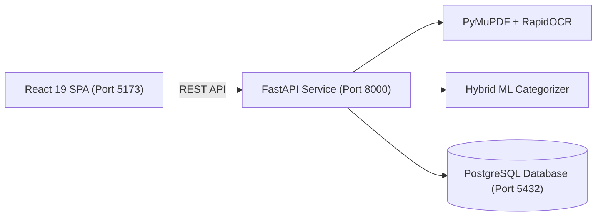

# Document Management System (DMS)

A full-stack, enterprise document management and classification platform featuring defense-in-depth PDF ingestion, dual-pass text extraction, CPU-based ONNX Optical Character Recognition (OCR), and hybrid Machine Learning classification.

---

## 🚀 Quick Start in 60 Seconds

### 1. Start the Backend API (Port 8000)
```bash
# Setup Python 3.12 Virtual Environment
python -m venv .venv
.venv\Scripts\activate      # Windows (or: source .venv/bin/activate on macOS/Linux)

# Install Dependencies
pip install -r requirements.txt

# Start Uvicorn Server
uvicorn main:app --reload --host 127.0.0.1 --port 8000
```

### 2. Start the Frontend Web App (Port 5173)
```bash
cd frontend
pnpm install               # or: npm install
pnpm run dev               # or: npm run dev
```

### 3. Open the Application
- **Frontend Dashboard**: [http://localhost:5173](http://localhost:5173)
- **Interactive API Documentation (Swagger)**: [http://localhost:8000/docs](http://localhost:8000/docs)
- **API Health Check**: [http://localhost:8000/health](http://localhost:8000/health)

---

## 📚 Complete Technical Documentation System

The complete technical documentation suite is organized in the [`docs/`](file:///c:/Users/shail/OneDrive/Desktop/project/docs/README.md) directory:

```text
docs/
├── README.md                             # Documentation Homepage & System Map
├── DOCUMENTATION_AUDIT.md                # Codebase Verification & Coverage Audit Report
├── DOCUMENTATION_ISSUES.md               # Technical Debt, Inconsistencies & Security Findings
│
├── 01-overview/                          # System Purpose, Capabilities & High-Level Design
│   ├── project-overview.md               # Business purpose, problem statement, key workflows
│   ├── features.md                       # Implemented, partially implemented & planned features
│   ├── technology-stack.md               # Verified backend, frontend, ORM, OCR & ML tech stack
│   ├── project-structure.md              # Physical repository directory layout & file responsibilities
│   └── glossary.md                       # Domain terminology, acronyms & definitions
│
├── 02-getting-started/                   # Onboarding & Environment Setup Guides
│   ├── prerequisites.md                  # Required runtime runtimes, tools, versions & system specs
│   ├── installation.md                   # Step-by-step backend & frontend package installation
│   ├── environment-setup.md              # Configuration variables, `.env` files & templates
│   ├── database-setup.md                 # PostgreSQL installation, database creation & auto-seeding
│   ├── running-locally.md                # Exact commands to run development servers & verify health
│   └── troubleshooting.md                # Common setup errors, port conflicts & verified resolutions
│
├── 03-architecture/                      # System Architecture & Component Interactions
│   ├── system-architecture.md            # High-level architecture, module boundaries & Mermaid diagrams
│   ├── frontend-architecture.md          # React 19 SPA architecture, state management & routing
│   ├── backend-architecture.md           # FastAPI architecture, lifespan events, modular routers & DI
│   ├── database-architecture.md          # PostgreSQL architecture, SQLModel ORM & connection pooling
│   ├── api-architecture.md               # REST API design conventions, DTO schemas & error handling
│   └── data-flow.md                      # End-to-end data flow for document ingestion & classification
│
├── 04-backend/                           # Backend Deep Dive & Processing Engines
│   ├── backend-structure.md              # Backend package structure (src/api, src/data, src/model)
│   ├── api-endpoints.md                  # Route catalog for Users, Categories & Documents
│   ├── authentication.md                 # Password hashing (Argon2 / pwdlib), login & credentials
│   ├── document-processing.md            # Ingestion lifecycle, size validation & BYTEA BLOB storage
│   ├── pdf-processing.md                 # PyMuPDF digital text extraction & 150 DPI page rendering
│   ├── ocr.md                            # RapidOCR (ONNX Runtime) OCR engine, singleton caching
│   ├── classification.md                 # Hybrid ML (TF-IDF + Naive Bayes) + DB keyword boosting
│   └── error-handling.md                 # Exception handlers, validation error schemas & HTTP codes
│
├── 05-frontend/                          # Frontend Web Application Deep Dive
│   ├── frontend-structure.md             # React component hierarchy & stylesheet organization
│   ├── pages.md                          # Route pages (Login, Register, Dashboard, Upload)
│   ├── components.md                     # Reusable UI components (Header, Footer, CategoryCard)
│   ├── routing.md                        # React Router v7 configuration, navigation & guards
│   ├── api-integration.md                # Fetch clients, multipart uploads & BLOB downloads
│   └── authentication.md                 # Client-side session management (localStorage) & logout
│
├── 06-database/                          # Database Schemas & Data Layer
│   ├── database-schema.md                # PostgreSQL schema reference & complete Mermaid ERD
│   ├── tables-and-models.md              # SQLModel table definitions & column constraints
│   ├── relationships.md                  # Junction tables (1-to-Many & Many-to-Many mappings)
│   └── migrations.md                     # Dynamic schema initialization, seeding & document backfill
│
├── 07-development/                       # Engineering Standards & Tooling
│   ├── development-workflow.md           # Day-to-day coding workflows & hot-reload setup
│   ├── coding-standards.md               # Python & TypeScript coding guidelines & type annotations
│   ├── testing.md                        # Testing landscape, pytest/vitest guidance & test matrices
│   ├── linting-and-formatting.md         # Black, isort, mypy, ESLint 10 & Prettier configurations
│   └── git-workflow.md                   # Branching models, commit conventions & Git setup
│
├── 08-security/                          # Security Review & Protections
│   ├── security-overview.md              # Defense-in-depth posture & threat mitigation
│   ├── file-security.md                  # MIME checking, magic bytes (%PDF) & 3MB upload guard
│   ├── authentication-security.md        # Password hashing with Argon2, credentials & session state
│   └── environment-security.md           # Secret handling, CORS policies & SQL injection defense
│
├── 09-deployment/                        # Deployment Guides & Production Operations
│   ├── deployment-overview.md            # Production architecture & deployment topologies
│   ├── frontend-deployment.md            # Vite production builds (dist/) & static asset hosting
│   ├── backend-deployment.md             # Uvicorn / Gunicorn production execution & systemd/container
│   ├── database-deployment.md            # PostgreSQL production configuration, pooling & maintenance
│   └── production-checklist.md           # Go-live verification checklist
│
├── 10-maintenance/                       # Operations, Reliability & Maintenance
│   ├── monitoring.md                     # Health checks (/health), logging & performance tracking
│   ├── backups.md                        # PostgreSQL database backup (pg_dump) & recovery
│   ├── troubleshooting.md                # Operational incidents, OCR memory issues & debugging
│   └── maintenance-guide.md              # Category synchronization, keyword tuning & DB pruning
│
└── 11-reference/                         # Quick Reference Sheets
    ├── api-reference.md                  # Complete OpenAPI 3.1 specification & endpoint reference
    ├── environment-variables.md          # Environment variable reference table with defaults
    └── commands.md                       # Comprehensive CLI commands cheat sheet
```

---

## 🏛️ System Architecture Summary



For in-depth architectural and operational guides, start at [`docs/README.md`](file:///c:/Users/shail/OneDrive/Desktop/project/docs/README.md).
