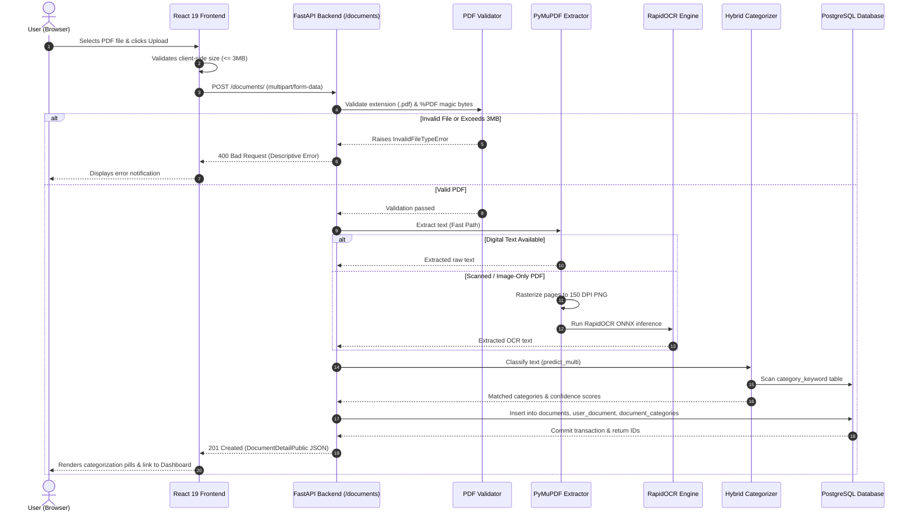

# Project Overview

The **Document Management System** is a full-stack, enterprise-oriented document processing and classification web platform. It automates the ingestion, security validation, text extraction, optical character recognition (OCR), multi-category classification, and relational organization of PDF files.

---

## 🎯 Purpose & Problem Statement

Organizations routinely receive hundreds of varied unstructured documents—such as invoices, legal contracts, executive summaries, medical prescriptions, and meeting minutes. Manually reviewing, transcribing, categorizing, and cataloging these documents is error-prone, time-consuming, and resource-intensive.

The **Document Management System** solves this challenge by providing:
1. **Automated Ingestion & Validation**: Rejects malformed or non-PDF files using defense-in-depth magic-byte inspection and file size enforcement.
2. **Dual-Pass Text Extraction**: Instantaneously extracts digital vector text and transparently falls back to high-resolution OCR (Optical Character Recognition) for scanned physical documents.
3. **Hybrid AI/Keyword Classification**: Analyzes document semantics using Machine Learning (TF-IDF vectorization + Multinomial Naive Bayes) combined with dynamic domain keyword density boosting from PostgreSQL.
4. **Relational Organization & Management**: Maintains user ownership, multi-category associations, extracted text previews, and binary BLOB download streaming in a responsive modern web dashboard.

---

## 👥 Intended Users & Roles

- **Knowledge Workers & Operations Analysts**: Upload batches of PDF files, review automated categorizations, filter documents by category, and download originals.
- **System Administrators**: Manage database health, monitor OCR processing throughput, and maintain domain keyword dictionaries.
- **Software Engineers**: Integrate upstream systems via RESTful JSON/multipart endpoints.

---

## 🔄 High-Level Document Lifecycle

---

## 🔑 Key Architectural Terminology

- **BLOB (Binary Large Object)**: Raw PDF binary payload stored directly in the `documents.body` column (`BYTEA` data type in PostgreSQL).
- **Dual-Pass Extraction**: A performance optimization strategy where fast digital text extraction is attempted first, reserving computationally intensive OCR only for scanned pages.
- **Magic Bytes**: The byte sequence `b"%PDF"` found at the start of legitimate PDF files used to prevent file-extension spoofing attacks.
- **Hybrid Categorization**: A scoring model that calculates a 60% weight from a trained Naive Bayes classifier and a 40% weight from database domain keyword hits.
- **Junction Table**: A relational database table (`document_categories`, `user_document`) used to model Many-to-Many and One-to-Many associations between primary entities.
