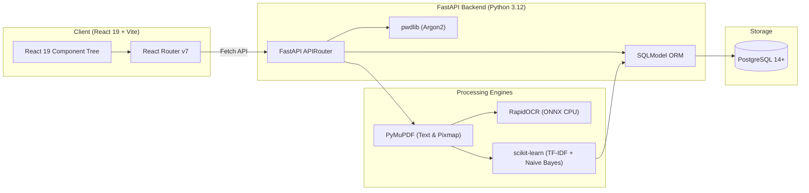

# Technology Stack

Every technology, library, framework, and tool listed here has been verified against the project configuration files (`pyproject.toml`, `requirements.in`, `requirements.txt`, `frontend/package.json`, and `frontend/vite.config.ts`).

---

## 💻 Full-Stack Technology Matrix

| Layer / Domain | Technology | Version | Purpose in Project | Configuration Source |
| :--- | :--- | :--- | :--- | :--- |
| **Backend Runtime** | Python | `>=3.12` | Core backend programming language | `pyproject.toml`, `requirements.in` |
| **Backend Framework** | FastAPI | `0.141.1` | High-performance asynchronous REST API framework | `requirements.in` (`fastapi==0.141.1`) |
| **ASGI Server** | Uvicorn | `0.52.1` | Lightning-fast ASGI web server with hot-reload | `requirements.in` (`uvicorn==0.52.1`) |
| **Database** | PostgreSQL | `>=14` | Relational database storing metadata, keywords, and binary BLOBs | `backend/src/constants/constant.py` |
| **Database Driver** | psycopg2-binary | `2.9.12` | PostgreSQL adapter for Python and SQLAlchemy | `requirements.in` (`psycopg2-binary==2.9.12`) |
| **ORM / Data Access** | SQLModel | `0.0.39` | Python ORM blending SQLAlchemy with Pydantic data validation | `requirements.in` (`sqlmodel==0.0.39`) |
| **PDF Processing** | PyMuPDF | `1.28.2` | Digital text extraction & 150 DPI page rendering to image pixmaps | `requirements.in` (`pymupdf==1.28.2`) |
| **OCR Engine** | RapidOCR (ONNX Runtime) | `1.4.4` | CPU-based ONNX OCR text recognition for scanned pages | `requirements.in` (`rapidocr-onnxruntime==1.4.4`) |
| **Image Processing** | Pillow (PIL) | `12.3.0` | Image handling and byte conversions for OCR | `requirements.in` (`Pillow==12.3.0`) |
| **Machine Learning** | scikit-learn | `>=1.4.0` | TF-IDF Vectorizer & Multinomial Naive Bayes classifier | `requirements.in` (`scikit-learn>=1.4.0`) |
| **Model Serialization**| joblib | `>=1.3.2` | Pipeline serialization and scientific computing utilities | `requirements.in` (`joblib>=1.3.2`) |
| **Password Security** | pwdlib[argon2] | `0.3.1` | Argon2 password hashing and verification | `requirements.in` (`pwdlib[argon2]==0.3.1`) |
| **Multipart Parser** | python-multipart | `0.0.32` | Streaming multipart/form-data upload parsing in FastAPI | `requirements.in` (`python-multipart==0.0.32`) |
| **Frontend Framework**| React | `19.2.8` | Component-based Single Page Application UI library | `frontend/package.json` |
| **Frontend DOM** | React DOM | `19.2.8` | React DOM renderer with StrictMode support | `frontend/package.json` |
| **Frontend Language** | TypeScript | `~6.0.2` | Static typing for React components and utilities | `frontend/package.json` |
| **Frontend Bundler** | Vite | `^8.2.2` | Next-generation frontend build tool and dev server | `frontend/package.json`, `vite.config.ts` |
| **Client Routing** | React Router DOM | `^7.18.3` | Client-side declarative routing and navigation | `frontend/package.json` |
| **Frontend Package Manager** | pnpm | `^9.0` | Fast, disk space efficient package manager | `frontend/pnpm-lock.yaml` |
| **Python Code Formatter** | Black | `>=24.0.0` | Uncompromising Python code formatter (line-length: 100) | `pyproject.toml` (`[tool.black]`) |
| **Python Import Sorter** | isort | `>=5.13.0` | Standardized Python import sorting (black profile) | `pyproject.toml` (`[tool.isort]`) |
| **Python Static Type Checker** | mypy | `>=1.11.0` | Static type analysis with `pydantic.mypy` plugin | `pyproject.toml` (`[tool.mypy]`) |
| **Frontend Linter** | ESLint | `^10.9.0` | JavaScript/TypeScript linter with React Hooks plugin | `frontend/package.json`, `eslint.config.js` |
| **Frontend Formatter** | Prettier | `^3.9.7` | Opinionated code formatter for `.ts`, `.tsx`, `.css`, `.json` | `frontend/package.json`, `.prettierrc` |

---

## 🏗️ Architectural Component Rationale

