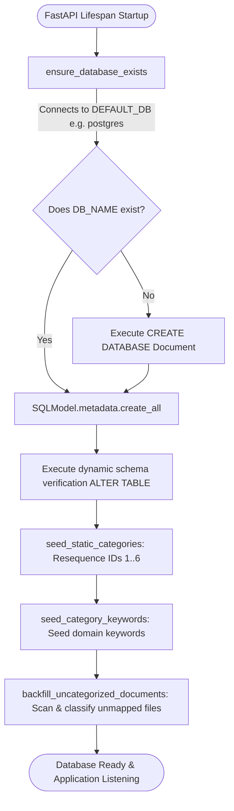

# Database Setup & Initialization Guide

The **Document Management System** uses **PostgreSQL** as its relational storage engine and **SQLModel** as its ORM layer.

---

## 🗄️ Database Lifecycle Architecture

The application implements a self-provisioning, automated database lifecycle:



---

## 📥 Step 1: Install and Start PostgreSQL

### Windows
If PostgreSQL is installed via installer or Chocolatey:
```powershell
# Start PostgreSQL service if not running
Start-Service postgresql-x64-16
```

### macOS (Homebrew)
```bash
brew services start postgresql@16
```

### Linux (Ubuntu / Debian)
```bash
sudo systemctl start postgresql
sudo systemctl enable postgresql
```

---

## 🔑 Step 2: Configure PostgreSQL User & Password

Connect to PostgreSQL via `psql` to verify or configure your credentials matching your `.env` settings:

```bash
psql -U postgres -h localhost
```

Inside the `psql` prompt:
```sql
-- Set password for the postgres user (or create a dedicated user)
ALTER USER postgres WITH PASSWORD 'your_secure_password_here';

-- Ensure default database exists
SELECT datname FROM pg_database WHERE datname = 'postgres';
```

---

## 🚀 Step 3: Automated Database Provisioning on Startup

You do **not** need to manually run `CREATE DATABASE Document;` or create any tables.

When the backend application boots via `uvicorn main:app`, the `lifespan` handler automatically triggers `create_db_and_tables()` in `backend/src/data/database.py`:

1. **`ensure_database_exists()`**: Connects to `postgres` and creates `Document` if it does not exist.
2. **`SQLModel.metadata.create_all(engine)`**: Creates the tables:
   - `users`
   - `categories`
   - `documents`
   - `document_categories`
   - `user_document`
   - `category_keyword`
3. **`seed_static_categories()`**: Inserts and normalizes the 6 core system categories with IDs 1 to 6:
   - `1`: `Invoice`
   - `2`: `Contracts`
   - `3`: `Reports`
   - `4`: `Notes`
   - `5`: `Medical`
   - `6`: `Others`
4. **`seed_category_keywords()`**: Seeds the reference domain keywords for each category into the `category_keyword` table.
5. **`backfill_uncategorized_documents()`**: Checks for any unmapped documents in the database and runs OCR extraction and keyword categorization automatically.

---

## 🔍 Step 4: Verification of Database Tables

You can verify that all tables and seed data were created using `psql`:

```bash
psql -U postgres -h localhost -d Document -c "\dt"
```

Expected output:
```text
               List of relations
 Schema |        Name         | Type  |  Owner   
--------+---------------------+-------+----------
 public | categories          | table | postgres
 public | category_keyword    | table | postgres
 public | document_categories | table | postgres
 public | documents           | table | postgres
 public | user_document       | table | postgres
 public | users               | table | postgres
```

Verify seeded categories:
```bash
psql -U postgres -h localhost -d Document -c "SELECT id, name FROM categories ORDER BY id;"
```

Output:
```text
 id |   name    
----+-----------
  1 | Invoice
  2 | Contracts
  3 | Reports
  4 | Notes
  5 | Medical
  6 | Others
(6 rows)
```
