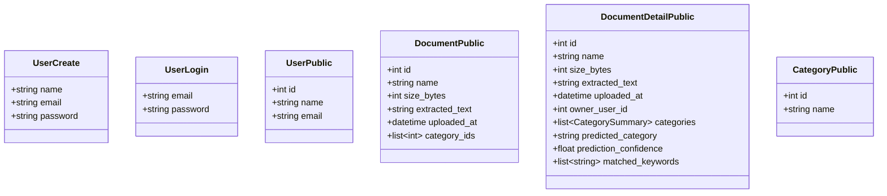

# API Architecture & Conventions

This document outlines the REST architectural style, serialization standards, Data Transfer Object (DTO) contracts, and error handling schemes employed by the FastAPI service.

---

## 🌐 API Design Standards & Conventions

1. **Protocol**: HTTP/1.1 REST over JSON and `multipart/form-data`.
2. **Resource Prefixing**:
   - `/users`: User identity and user-document resources.
   - `/categories`: Master category resources (Read-Only).
   - `/documents`: Document upload, streaming, and metadata resources.
3. **Data Serialization**:
   - Request and response schemas are strictly typed using SQLModel / Pydantic models.
   - Passwords and binary BLOB payloads are explicitly excluded from public listing DTOs (`UserPublic`, `DocumentPublic`) to maintain optimal performance and security.
4. **Standard HTTP Status Codes**:
   - `200 OK`: Successful synchronous retrieval, update, or login.
   - `201 Created`: Successful resource persistence (User registration, Document upload).
   - `400 Bad Request`: Validation failure (Invalid file type, non-PDF file, file > 3MB).
   - `401 Unauthorized`: Invalid login credentials.
   - `404 Not Found`: Target entity ID not found.
   - `409 Conflict`: Unique constraint violation (Email already registered).
   - `422 Unprocessable Entity`: Request body or parameter failed Pydantic schema validation.
   - `500 Internal Server Error`: Unhandled database or extraction runtime error.

---

## 📦 Key DTO / Schema Contracts



---

## 🛑 Standard Error Response Format

FastAPI returns standardized error payloads with a `detail` property:

```json
{
  "detail": "Selected file is incorrect. Only PDF files (.pdf) are allowed. Received: 'sample.docx'"
}
```

For Pydantic validation errors (`HTTP 422`), `detail` returns an array of location and message objects:

```json
{
  "detail": [
    {
      "loc": ["body", "email"],
      "msg": "field required",
      "type": "value_error.missing"
    }
  ]
}
```
