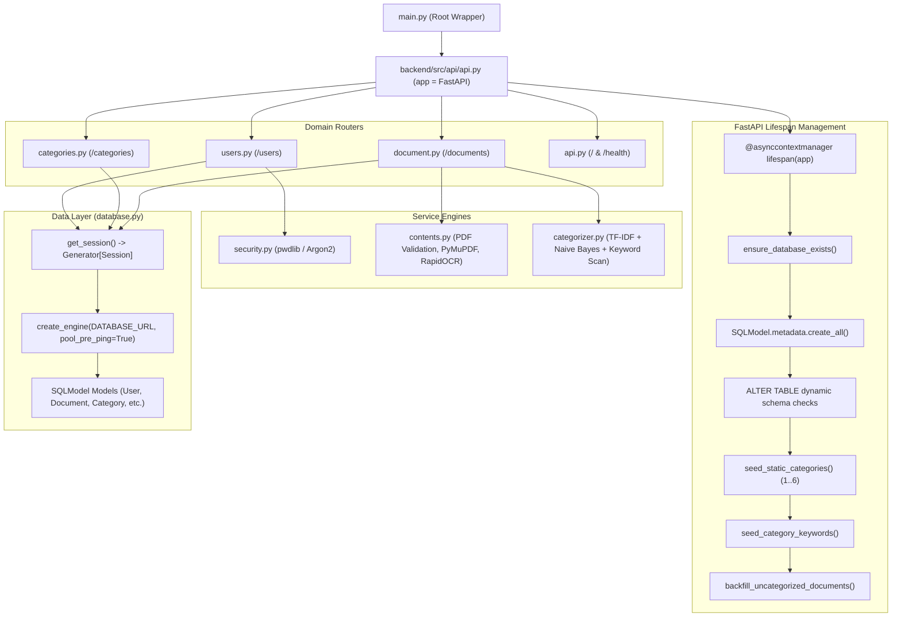

# Backend Architecture

This document describes the internal architecture of the FastAPI backend service, including the lifespan lifecycle manager, router modularization, dependency injection, and data access layer.

---

## 🏗️ Backend Module Breakdown



---

## ⚙️ Core Backend Architectural Patterns

### 1. Lifespan Context Manager
FastAPI's modern `@asynccontextmanager` pattern (`backend/src/api/api.py:lifespan`) manages the application startup and shutdown lifecycle:
- On startup: Executes `create_db_and_tables()` in `database.py`, provisioning the PostgreSQL database, verifying table schemas, seeding static categories and domain keywords, and running backfill classification on unmapped documents.
- On shutdown: Safely releases resources.

### 2. Domain Router Decoupling
The backend avoids monolithic route files by segregating endpoints into domain-specific `APIRouter` instances:
- `Users` (`prefix="/users"`, `tags=["Users"]`): User signup, login, profile retrieval, and user-document ownership traversal.
- `Categories` (`prefix="/categories"`, `tags=["Categories"]`): Read-only category master data lookups and category-document relationship traversal.
- `Documents` (`prefix="/documents"`, `tags=["Documents"]`): Multipart file upload, PDF magic-byte validation, OCR extraction, classification, and binary BLOB streaming downloads.

### 3. Dependency Injection (DI) with Typed Annotations
All database operations use FastAPI's dependency injection system via `get_session()` in `database.py`:
```python
def get_session() -> Generator[Session, None, None]:
    with Session(engine) as session:
        yield session
```
Endpoints declare session dependencies using Python 3.12 type annotations:
```python
session: Annotated[Session, Depends(get_session)]
```
This guarantees automatic session cleanup, transaction rollback on exceptions, and frictionless unit testing via dependency overrides.

### 4. Resilient Database Engine Configuration
The SQLModel/SQLAlchemy engine is initialized with `pool_pre_ping=True`:
```python
engine = create_engine(DATABASE_URL, echo=True, pool_pre_ping=True)
```
This validates connections before executing queries, automatically reconnecting if a connection in the pool was terminated by PostgreSQL.
