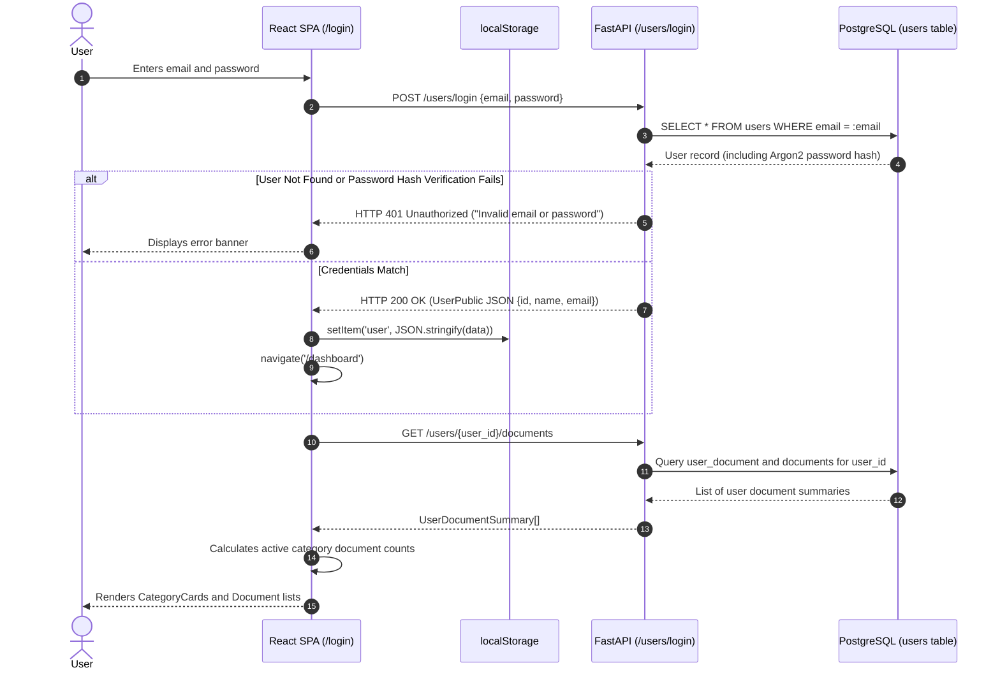
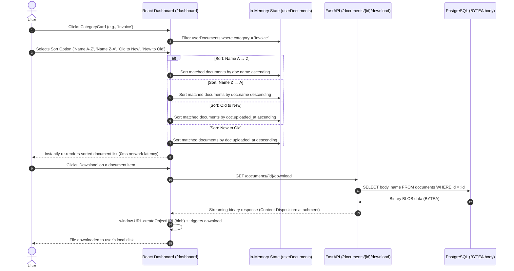

# End-to-End Data Flow

This document details the complete data flow journeys across the system for key workflows: document ingestion/classification and user authentication.

---

## 📄 1. Document Ingestion, OCR & Classification Data Flow

```mermaid
flowchart TD
    subgraph ClientStage["Stage 1: Client Ingestion"]
        A[User selects file in /upload] --> B{Client Size Check <= 3MB?}
        B -- No --> C[Display error & cancel upload]
        B -- Yes --> D[Construct FormData with file and owner_user_id]
        D --> E[HTTP POST /documents/]
    end

    subgraph ValidationStage["Stage 2: Defense-in-Depth Validation (contents.py)"]
        E --> F{Is file empty?}
        F -- Yes --> G[Raise InvalidFileTypeError 400]
        F -- No --> H{Is size <= 3MB?}
        H -- No --> I[Raise InvalidFileTypeError 400]
        H -- Yes --> J{Does filename end with .pdf?}
        J -- No --> K[Raise InvalidFileTypeError 400]
        J -- Yes --> L{Does byte stream start with %PDF?}
        L -- No --> M[Raise InvalidFileTypeError 400]
        L -- Yes --> N[Pass to Dual-Pass Extraction]
    end

    subgraph ExtractionStage["Stage 3: Dual-Pass Text Extraction"]
        N --> O[Open stream in PyMuPDF]
        O --> P[Iterate pages: page.get_text()]
        P --> Q{Is digital text found on page?}
        Q -- Yes --> R[Append page text to extracted list]
        Q -- No --> S[Render page to 150 DPI PNG Pixmap]
        S --> T[Run RapidOCR ONNX inference]
        T --> U[Append OCR text to extracted list]
        R --> V[Join all pages into full_text]
        U --> V
    end

    subgraph ClassificationStage["Stage 4: Hybrid ML & Keyword Classification (categorizer.py)"]
        V --> W[Normalize text: lowercase & whitespace cleanup]
        W --> X[Compute TF-IDF + Multinomial Naive Bayes probabilities]
        W --> Y[Scan normalized text against PostgreSQL category_keyword table]
        X & Y --> Z[Calculate Hybrid Blended Score: 60% ML + 40% Keywords]
        Z --> AA{Are category keyword hits >= 1?}
        AA -- Yes --> AB[Map to all matched categories]
        AA -- No --> AC[Assign fallback: 'Others' Category ID 6]
    end

    subgraph PersistenceStage["Stage 5: Database Persistence (database.py)"]
        AB & AC --> AD[Insert Document record with binary BYTEA body and extracted_text]
        AD --> AE[Insert user_document ownership record]
        AE --> AF[Insert document_categories junction records]
        AF --> AG[Commit Transaction]
    end

    subgraph ResponseStage["Stage 6: Client Response"]
        AG --> AH[Return 201 Created DocumentDetailPublic JSON]
        AH --> AI[Upload page displays category pill badges]
        AI --> AJ[Dashboard aggregates new document in category counts]
    end
```

---

## 🔐 2. User Authentication & Dashboard Access Flow



---

## 📊 3. Dashboard In-Memory Filtering, 4-Way Sorting & Download Flow


