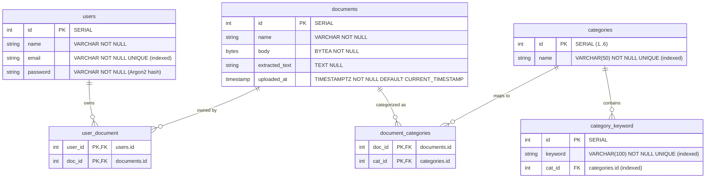

# Database Architecture

This document provides a comprehensive overview of the PostgreSQL database architecture, SQLModel ORM models, relational entity mappings, indexes, and constraints.

---

## 🗄️ Entity Relationship Diagram (ERD)

---

## 📋 Database Tables & Model Reference

### 1. `users` (`User`)
- **Purpose**: Stores registered user accounts and hashed authentication credentials.
- **Columns**:
  - `id`: `INTEGER PRIMARY KEY` (Auto-incrementing).
  - `name`: `VARCHAR NOT NULL` (User's display/full name).
  - `email`: `VARCHAR NOT NULL UNIQUE` (Indexed for fast login lookup).
  - `password`: `VARCHAR NOT NULL` (Argon2 hashed password).

### 2. `categories` (`Category`)
- **Purpose**: Master lookup table for the 6 canonical document categories.
- **Columns**:
  - `id`: `INTEGER PRIMARY KEY` (Resequenced 1 to 6).
  - `name`: `VARCHAR(50) NOT NULL UNIQUE` (Indexed).
- **Canonical Records**:
  - `1`: `Invoice`
  - `2`: `Contracts`
  - `3`: `Reports`
  - `4`: `Notes`
  - `5`: `Medical`
  - `6`: `Others`

### 3. `documents` (`Document`)
- **Purpose**: Stores ingested PDF binary payloads and extracted OCR text.
- **Columns**:
  - `id`: `INTEGER PRIMARY KEY` (Auto-incrementing).
  - `name`: `VARCHAR NOT NULL` (Original filename).
  - `body`: `BYTEA NOT NULL` (Raw PDF binary stream).
  - `extracted_text`: `TEXT NULL` (Extracted digital/OCR text).
  - `uploaded_at`: `TIMESTAMP WITH TIME ZONE NOT NULL DEFAULT CURRENT_TIMESTAMP`.

### 4. `user_document` (`UserDocument`)
- **Purpose**: Junction table implementing the One-to-Many ownership relationship between Users and Documents.
- **Columns**:
  - `user_id`: `INTEGER NOT NULL FOREIGN KEY (users.id)`.
  - `doc_id`: `INTEGER NOT NULL FOREIGN KEY (documents.id)`.
  - Composite Primary Key: `(user_id, doc_id)`.

### 5. `document_categories` (`DocumentCategories`)
- **Purpose**: Junction table implementing the Many-to-Many relationship between Documents and Categories.
- **Columns**:
  - `doc_id`: `INTEGER NOT NULL FOREIGN KEY (documents.id)`.
  - `cat_id`: `INTEGER NOT NULL FOREIGN KEY (categories.id)`.
  - Composite Primary Key: `(doc_id, cat_id)`.

### 6. `category_keyword` (`CategoryKeyword`)
- **Purpose**: Reference dictionary of domain keywords associated with each category.
- **Columns**:
  - `id`: `INTEGER PRIMARY KEY` (Auto-incrementing).
  - `keyword`: `VARCHAR(100) NOT NULL UNIQUE` (Indexed).
  - `cat_id`: `INTEGER NOT NULL FOREIGN KEY (categories.id)` (Indexed).
