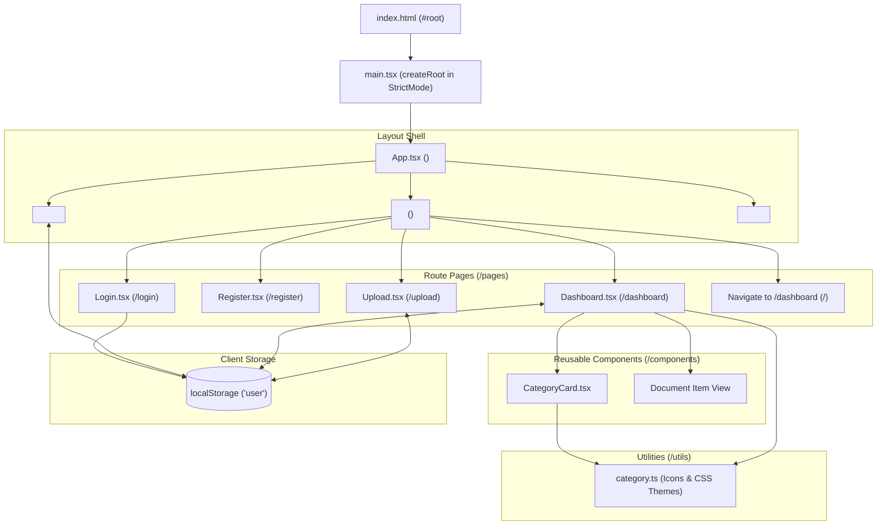

# Frontend Architecture

This document describes the design, component hierarchy, client-side routing, and state management flow of the **Document Management System** React frontend.

---

## ⚛️ Frontend Architecture Overview

---

## 🌲 Component Hierarchy & Responsibilities

| Component | File Path | Scope & Responsibility |
| :--- | :--- | :--- |
| `main.tsx` | `frontend/src/main.tsx` | React 19 entrypoint mounting `App` into the DOM `#root` node in `StrictMode`. |
| `App.tsx` | `frontend/src/App.tsx` | Top-level routing wrapper defining the application shell (Header, Routes, Footer). |
| `Header` | `frontend/src/components/header.tsx` | Universal navigation bar with dynamic session state, brand icon, route links, and logout handler. |
| `Footer` | `frontend/src/components/footer.tsx` | Universal application footer displaying copyright year and links. |
| `CategoryCard` | `frontend/src/components/categorycard.tsx` | Reusable category widget rendering theme-colored gradients, icons, document counts, and click selection. |
| `Login` | `frontend/src/pages/login.tsx` | Authentication screen; submits credentials to `/users/login` and persists session to `localStorage`. |
| `Register` | `frontend/src/pages/register.tsx` | Signup screen; submits user profile to `/users/` and redirects to `/login`. |
| `Dashboard` | `frontend/src/pages/dashboard.tsx` | Core user dashboard; calculates user-specific category document counts, renders category cards, filters documents, and handles binary downloads. |
| `Upload` | `frontend/src/pages/upload.tsx` | Drag-and-drop / file selector PDF upload page; validates 3MB size limit and renders real-time classification feedback. |
| `category.ts` | `frontend/src/utils/category.ts` | Utility helper providing emoji lookup (`getCategoryIcon`) and theme class mappings (`getCategoryTheme`). |

---

## 🗃️ Client-Side State Management

The frontend uses lightweight React state hooks (`useState`, `useEffect`, `useCallback`) alongside browser `localStorage` for cross-page session continuity:

1. **Authentication Session**:
   - On successful login, `POST /users/login` returns a `UserPublic` JSON payload (`{ id: number, name: string, email: string }`).
   - The user payload is serialized to `localStorage.setItem('user', JSON.stringify(data))`.
   - The `Header` component inspects `localStorage` on route transitions (`useLocation()`) to render either the logged-in navigation (Dashboard, Upload, User Badge, Logout) or public links (Login, Register).
   - The `Dashboard` component verifies `localStorage` on mount; if absent, it redirects to `/login`.

2. **Dashboard State Management & In-Memory Caching**:
   - `userDocuments`: In-memory cache of all `UserDocumentItem` records owned by the user. Fetched once on mount and reused across category switches and sort changes without duplicate network overhead.
   - `categories`: Computed active categories with document counts `> 0`.
   - `selectedCategory`: Current category filter string, enabling drill-down into specific documents.
   - `sortOption`: Current sorting mode (`name_asc`, `name_desc`, `time_asc`, `time_desc`). Handled by `useMemo` in memory.
   - `downloadingId`: Tracks the ID of a document currently being downloaded to show a loading spinner.
