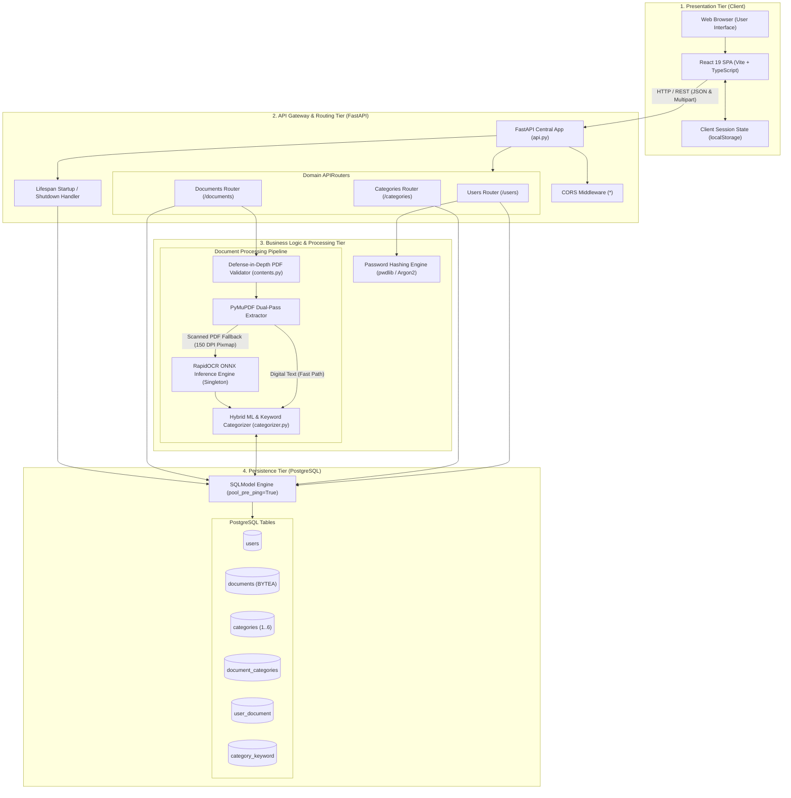

# System Architecture

This document presents the high-level architecture, subsystem boundaries, data storage patterns, and inter-service communications of the **Document Management System**.

---

## 🏛️ System Block Architecture

---

## 🧩 Architectural Subsystems & Boundaries

### 1. Presentation Tier
- Implemented as a Single Page Application (SPA) using React 19 and TypeScript.
- Built using Vite, compiled to static HTML/JS/CSS assets.
- Manages view rendering, client-side routing via React Router DOM v7, and asynchronous HTTP calls using standard browser `fetch()`.

### 2. API Gateway & Routing Tier
- Implemented in FastAPI (`backend/src/api/api.py`).
- Manages HTTP connection lifecycles, parses incoming multipart/form-data payloads, serializes outgoing DTO responses, and executes dependency injection for database sessions.
- Domain routers are cleanly isolated by resource:
  - `Users` (`backend/src/api/users.py`)
  - `Categories` (`backend/src/api/categories.py`)
  - `Documents` (`backend/src/api/document.py`)

### 3. Processing & Machine Learning Tier
- **Validation Engine**: Guarantees that only valid PDF byte streams under 3 MB enter the system.
- **Dual-Pass Extraction Engine**: Uses PyMuPDF for zero-overhead vector text extraction, seamlessly switching to RapidOCR ONNX inference on rasterized 150 DPI page pixmaps when digital text is absent.
- **Classification Engine**: Combines a trained TF-IDF + Multinomial Naive Bayes pipeline with live PostgreSQL keyword dictionary boosting.

### 4. Relational Persistence Tier
- Managed via PostgreSQL and SQLModel.
- Stores user accounts, category metadata, domain keywords, junction associations, extracted OCR text, and the raw binary document payloads.
