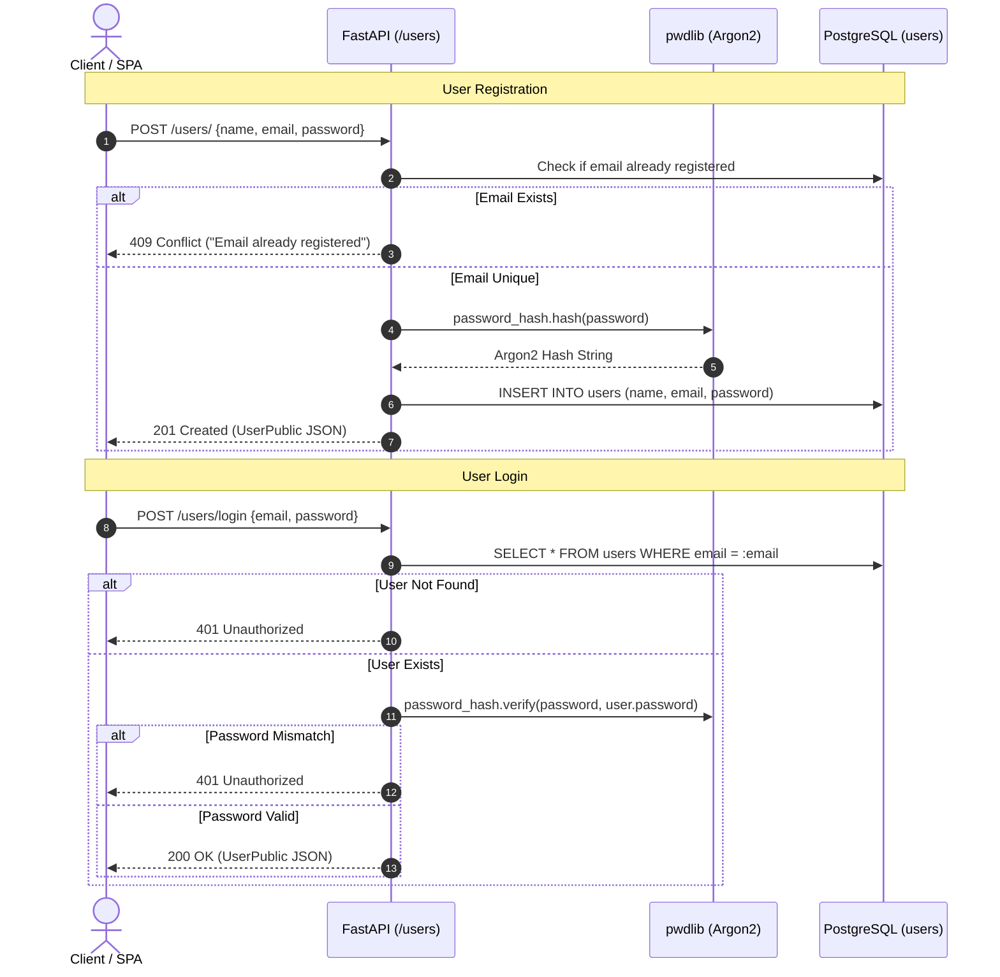

# Backend Authentication & Password Security

This document explains the authentication mechanism, password hashing implementation, and session state handling in the backend service.

---

## 🔒 Password Hashing Implementation

Password security is centralized in `backend/src/api/security.py`:

```python
from pwdlib import PasswordHash

# Initialize a single shared PasswordHash instance using recommended algorithms
password_hash = PasswordHash.recommended()
```

### Key Technical Details:
1. **Algorithm**: `pwdlib[argon2]` utilizes **Argon2id**—the modern, memory-hard winner of the Password Hashing Competition.
2. **Salting & Pepper**: Argon2 automatically generates a cryptographically secure random salt per password hash.
3. **Registration Flow**:
   ```python
   # In src/api/users.py:create_user
   hashed_password = password_hash.hash(user_in.password)
   db_user = User(
       name=user_in.name,
       email=user_in.email,
       password=hashed_password,
   )
   ```
4. **Verification Flow**:
   ```python
   # In src/api/users.py:login_user
   if not user or not password_hash.verify(credentials.password, user.password):
       raise HTTPException(
           status_code=status.HTTP_401_UNAUTHORIZED,
           detail="Invalid email or password. Please check your credentials.",
       )
   ```

---

## 🔑 Authentication Workflow & Endpoints



---

## ⚠️ Security Notes & Current Limitations

- **Stateless Entity Exchange**: The login endpoint returns `UserPublic` (`{ id, name, email }`). It does not issue signed JSON Web Tokens (JWT) or secure HTTP-only session cookies.
- **Client Persistence**: The frontend persists this sanitized user object in browser `localStorage`.
- **Recommendation**: For production environments requiring strict endpoint authorization, implement JWT Bearer token authentication via FastAPI `OAuth2PasswordBearer` (cataloged in [`docs/DOCUMENTATION_ISSUES.md`](file:///c:/Users/shail/OneDrive/Desktop/project/docs/DOCUMENTATION_ISSUES.md)).
