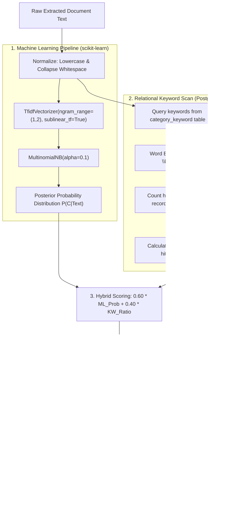

# Document Classification & Categorization Engine

This document explains the hybrid document categorization engine implemented in `backend/src/model/categorizer.py`.

---

## 🧠 Hybrid Classification Architecture

The categorization engine blends Machine Learning probabilistic text classification with real-time relational keyword density boosting:

---

## 🎯 Scoring & Multi-Category Logic

### 1. Hybrid Formula
When domain keywords are present in the text:
$$\text{Score}(C) = (0.60 \times P_{\text{ML}}(C)) + (0.40 \times \frac{\text{Hits}(C)}{\text{Total Hits}})$$

When no domain keywords are present:
$$\text{Score}(C) = P_{\text{ML}}(C)$$

### 2. Multi-Category Classification (`predict_multi`)
In `backend/src/model/categorizer.py:DocumentCategorizer.predict_multi`:
- Iterates over all categories with $\ge 1$ keyword hit.
- Calculates per-category confidence:
  $$\text{Confidence} = \min(1.0, (\text{Hits} \times 0.15) + 0.40)$$
- Excludes `Others` from keyword hits (as `Others` is strictly a fallback).
- Sorts matched categories descending by match count.
- If no categories match, executes `_get_fallback_result()` returning `Others` with ID `6` and confidence `1.0`.

---

## 📚 Base Training Corpus (`BASE_TRAINING_CORPUS`)

The ML pipeline is trained on 28 multi-domain samples representing authentic business documents across 5 core categories:

| Category | Sample Topics in Training Corpus |
| :--- | :--- |
| **Invoice** | Tax invoices, commercial invoices, billing statements, payment receipts, proforma invoices, software license subscriptions, medical equipment invoices. |
| **Contracts** | Non-Disclosure Agreements (NDAs), Master Services Agreements (MSAs), employment contracts, software licenses, commercial leases, vendor agreements. |
| **Reports** | Quarterly financial reports (Q3), annual audit reports, market research, project status progress reports, technical evaluation reports, cybersecurity risk assessments. |
| **Notes** | Team standup meeting minutes, project brainstorming notes, client call notes, internal strategy memos, daily scratchpads, clinic staff syncs. |
| **Medical** | Prescription notes (Rx), inpatient hospital discharge summaries, complete blood count (CBC) pathology reports, MRI/CT radiology reports, medical certificates. |
| **Others** | Fallback category for documents not fitting the 5 domain classes. |

---

## 🗃️ Database Keyword Seeding

Static reference domain keywords are seeded during startup into `category_keyword` from `STATIC_CATEGORY_KEYWORDS` in `backend/src/data/database.py`:
- **Invoice**: `invoice`, `tax invoice`, `receipt`, `billing`, `subtotal`, `amount due`, `due date`, `vat`, `gst`, `purchase order`, `po number`, etc.
- **Contracts**: `agreement`, `contract`, `terms and conditions`, `confidentiality`, `nda`, `indemnification`, `governing law`, `signatory`, etc.
- **Reports**: `executive summary`, `report`, `findings`, `quarterly results`, `annual report`, `kpi`, `audit report`, etc.
- **Notes**: `meeting minutes`, `notes`, `action items`, `agenda`, `memo`, `brainstorming`, `to-do`, `follow-up`, etc.
- **Medical**: `prescription`, `diagnosis`, `medical report`, `pathology report`, `blood test`, `radiology`, `doctor`, `physician`, `medication`, `dosage`, etc.
