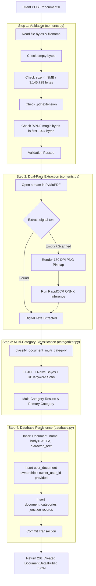

# Document Processing Pipeline

This document explains the complete document ingestion lifecycle, from HTTP multipart reception to validation, dual-pass text extraction, category resolution, and database BLOB storage.

---

## 🔄 Document Ingestion Lifecycle



---

## 🛡️ Defense-in-Depth Validation Rules

Implemented in `backend/src/model/contents.py:validate_pdf_file()`:

```python
def validate_pdf_file(file_bytes: bytes, filename: str = "") -> None:
    # 1. Empty Payload Check
    if not file_bytes or len(file_bytes) == 0:
        raise InvalidFileTypeError("Selected file is incorrect. Uploaded file is empty.")

    # 2. File Size Check (<= 3MB)
    if len(file_bytes) > MAX_FILE_SIZE_BYTES:
        size_mb = len(file_bytes) / (1024 * 1024)
        raise InvalidFileTypeError(
            f"File size ({size_mb:.2f} MB) exceeds the maximum allowed limit of {MAX_FILE_SIZE_MB} MB. "
            f"Please upload a file less than or equal to {MAX_FILE_SIZE_MB} MB."
        )

    # 3. Filename Extension Check (case-insensitive)
    if filename:
        clean_name = filename.strip().lower()
        if not clean_name.endswith(".pdf"):
            raise InvalidFileTypeError(
                f"Selected file is incorrect. Only PDF files (.pdf) are allowed. Received: '{filename}'"
            )

    # 4. Magic Byte Signature Check (%PDF)
    if (
        not file_bytes.startswith(PDF_MAGIC_SIGNATURE)
        and PDF_MAGIC_SIGNATURE not in file_bytes[:1024]
    ):
        raise InvalidFileTypeError(
            "Selected file is incorrect. The file is not a valid PDF document."
        )
```

---

## 💾 Binary BLOB Storage in PostgreSQL

The raw PDF bytes are persisted directly inside the `documents` table in PostgreSQL using the `BYTEA` data type.

### Key Benefits:
- **Transactional Consistency**: If document metadata insertion fails, the binary payload is automatically rolled back in the same SQL transaction.
- **Zero External Infrastructure**: Eliminates external S3 or MinIO dependencies for local self-contained operation.

### Streaming Download Implementation:
In `backend/src/api/document.py:download_document`:
```python
return Response(
    content=doc.body,
    media_type="application/pdf",
    headers={
        "Content-Disposition": f'attachment; filename="{doc.name}"',
        "Content-Length": str(len(doc.body)),
    },
)
```
Streams the stored `BYTEA` bytes directly as an HTTP download attachment.
