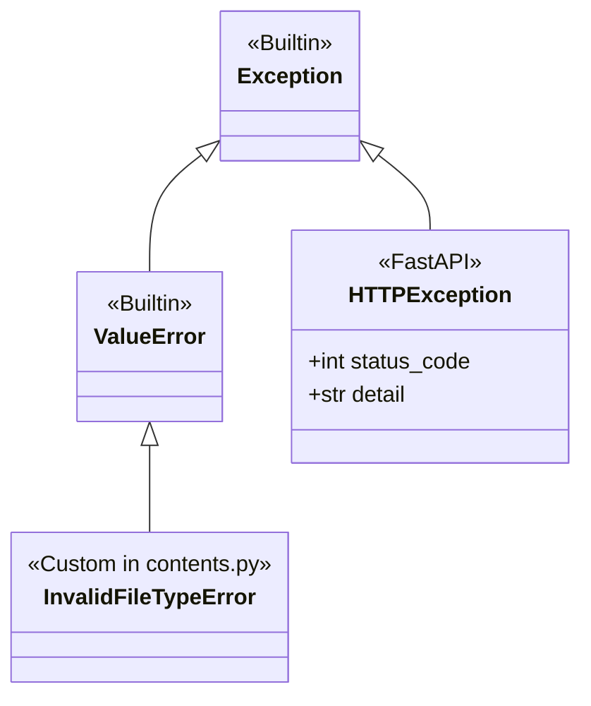

# Backend Error Handling

This document describes the exception hierarchy, HTTP status mapping, and structured error responses implemented in the FastAPI service.

---

## 🛑 Custom Exception Hierarchy



---

## 🚦 HTTP Status Code Mapping Matrix

| Scenario / Error Condition | Internal Exception | HTTP Status Code | Response Payload Structure |
| :--- | :--- | :--- | :--- |
| **Empty File Uploaded** | `InvalidFileTypeError` | `400 Bad Request` | `{"detail": "Selected file is incorrect. Uploaded file is empty."}` |
| **Upload Exceeds 3MB** | `InvalidFileTypeError` | `400 Bad Request` | `{"detail": "File size (4.20 MB) exceeds the maximum allowed limit of 3 MB..."}` |
| **Non-PDF Extension** | `InvalidFileTypeError` | `400 Bad Request` | `{"detail": "Selected file is incorrect. Only PDF files (.pdf) are allowed. Received: 'data.xlsx'"}` |
| **Missing %PDF Magic Bytes**| `InvalidFileTypeError` | `400 Bad Request` | `{"detail": "Selected file is incorrect. The file is not a valid PDF document."}` |
| **Corrupted PDF Stream** | `InvalidFileTypeError` | `400 Bad Request` | `{"detail": "Selected file is incorrect or contains corrupted PDF data."}` |
| **Invalid Login Credentials** | `HTTPException` | `401 Unauthorized` | `{"detail": "Invalid email or password. Please check your credentials."}` |
| **User ID Not Found** | `HTTPException` | `404 Not Found` | `{"detail": "User with ID 999 not found."}` |
| **Document ID Not Found** | `HTTPException` | `404 Not Found` | `{"detail": "Document with ID 999 not found."}` |
| **Category Not Found** | `HTTPException` | `404 Not Found` | `{"detail": "Category 'Tax' not found. Available categories in database: [1: 'Invoice', ...]"}` |
| **Duplicate Email on Signup**| `HTTPException` | `409 Conflict` | `{"detail": "Email 'user@example.com' is already registered."}` |
| **Invalid Request JSON / DTO**| `RequestValidationError` | `422 Unprocessable Entity`| `{"detail": [{"loc": ["body", "email"], "msg": "field required", "type": "..."}]}` |
| **Database Failure / Rollback**| `HTTPException` | `500 Internal Server Error` | `{"detail": "Database persistence error: <db_error_message>"}` |

---

## 🔄 Transaction Rollback on Error

In `backend/src/api/document.py:upload_document`, transactional rollback is enforced whenever an exception occurs during persistence:

```python
try:
    # 1. Insert Document
    session.add(db_document)
    session.commit()
    session.refresh(db_document)

    # 2. Insert Ownership & Category Junctions
    session.add(user_doc)
    session.add(doc_cat)
    session.commit()
except HTTPException:
    session.rollback()
    raise
except Exception as exc:
    session.rollback()
    raise HTTPException(
        status_code=status.HTTP_500_INTERNAL_SERVER_ERROR,
        detail=f"Database persistence error: {str(exc)}",
    ) from exc
```
This guarantees that orphaned document records or broken junction relationships are never persisted in the database.
