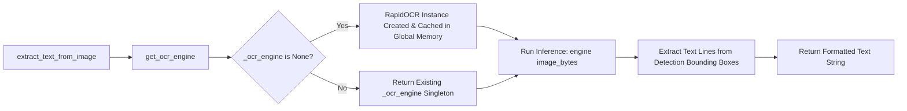

# Optical Character Recognition (OCR)

This document describes the Optical Character Recognition (OCR) engine implementation utilizing **RapidOCR** with **ONNX Runtime** on CPU.

---

## 🔬 RapidOCR Architecture & Singleton Pattern



---

## 🛠️ Implementation Details

In `backend/src/model/contents.py`:

```python
# Module-level singleton instance for ONNX runtime session reuse
_ocr_engine: RapidOCR | None = None


def get_ocr_engine() -> RapidOCR:
    """Lazy-initializes and caches the singleton RapidOCR engine."""
    global _ocr_engine
    if _ocr_engine is None:
        _ocr_engine = RapidOCR()
    return _ocr_engine


def extract_text_from_image(image_bytes: bytes) -> str | None:
    """
    Extracts text from rendered page image bytes using RapidOCR.
    Handles ONNX inference on CPU.
    """
    try:
        engine = get_ocr_engine()
        result, _ = engine(image_bytes)
        if not result:
            return None
        # result is a list of [bounding_box, text, confidence]
        lines = [line[1] for line in result if len(line) > 1 and line[1]]
        extracted = "\n".join(lines).strip()
        return extracted if extracted else None
    except Exception as exc:
        logger.warning(f"OCR image extraction error: {exc}")
        return None
```

---

## 🚀 Performance & Fault-Tolerance Highlights

1. **Singleton Session Reuse**:
   - Initializing an ONNX Runtime session requires allocating memory and loading model weights.
   - Using the `_ocr_engine` module-level singleton ensures ONNX models are loaded into RAM once upon first OCR invocation and reused across all subsequent requests.
2. **Zero External Binary Dependencies**:
   - Unlike Tesseract OCR, RapidOCR packages all necessary ONNX neural network weights directly within Python binary wheels. It does not require installing external system-level OCR binaries.
3. **Resilient Error Recovery**:
   - If an individual page image fails OCR inference or produces unreadable noise, `extract_text_from_image()` logs a warning and returns `None`, allowing the rest of the document's pages to complete processing without crashing the HTTP request.
