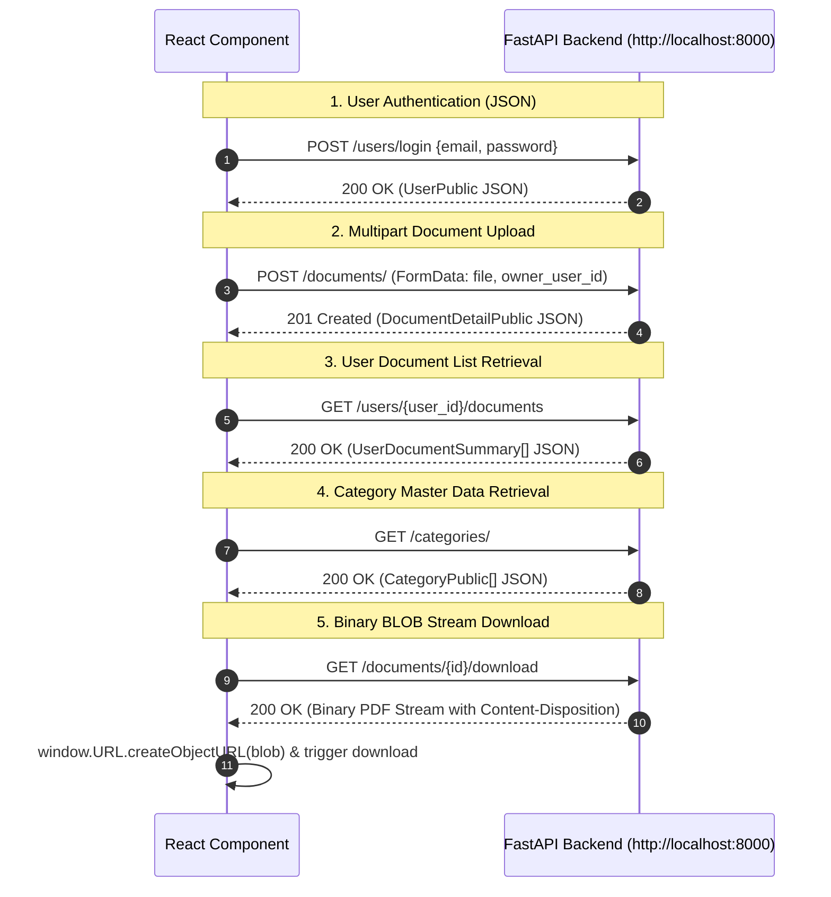

# Frontend API Integration & Data Fetching

This document outlines the communication patterns between the React Single Page Application and the FastAPI backend service.

---

## 📡 API Integration Patterns

The frontend communicates with the backend at `http://localhost:8000` using standard browser `fetch()` APIs:



---

## 💻 Integration Code Examples

### 1. Document Upload (Multipart / Form-Data)
In `frontend/src/pages/upload.tsx`:
```typescript
const formdata = new FormData();
formdata.append('file', selectedFile);

const user = JSON.parse(localStorage.getItem('user') || 'null');
if (user?.id) {
  formdata.append('owner_user_id', user.id.toString());
}

const response = await fetch('http://localhost:8000/documents/', {
  method: 'POST',
  body: formdata,
});

const data = await response.json();
```

### 2. Binary Document Download
In `frontend/src/pages/dashboard.tsx`:
```typescript
const response = await fetch(`http://localhost:8000/documents/${docId}/download`);
const blob = await response.blob();
const downloadUrl = window.URL.createObjectURL(blob);
const link = document.createElement('a');
link.href = downloadUrl;
link.download = fileName || `document-${docId}.pdf`;
document.body.appendChild(link);
link.click();
document.body.removeChild(link);
window.URL.revokeObjectURL(downloadUrl);
```

---

## 🛑 Error Parsing Standard

API error responses from FastAPI return either a string `detail` or an array of Pydantic validation errors. The frontend normalizes these errors cleanly:

```typescript
let errorMessage = 'An unexpected error occurred.';
if (data && data.detail) {
  errorMessage =
    typeof data.detail === 'string'
      ? data.detail
      : Array.isArray(data.detail)
        ? data.detail.map((err) => err.msg || '').filter(Boolean).join(', ')
        : JSON.stringify(data.detail);
}
```
