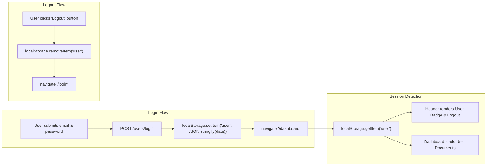

# Frontend Authentication & Session State

This document explains how client-side authentication, session persistence, route guards, and logout mechanisms are implemented in the React SPA.

---

## 🔐 Session Persistence Architecture

The frontend manages authenticated user state via the browser's `localStorage` API:



---

## 💻 Session Management Implementation

### 1. Retrieving Stored User Profile
In `frontend/src/components/header.tsx`:
```typescript
interface StoredUser {
  id: number;
  name: string;
  email: string;
}

function getStoredUser(): StoredUser | null {
  const stored = localStorage.getItem('user');
  if (!stored) return null;
  try {
    return JSON.parse(stored);
  } catch {
    return null;
  }
}
```

### 2. Header Session Synchronization
The Header uses React Router's `useLocation()` hook to trigger component re-evaluations whenever the active route changes, ensuring instantaneous visual synchronization without page refreshes:
```typescript
function Header() {
  const navigate = useNavigate();
  useLocation(); // Triggers header update on route navigation
  const user = getStoredUser();

  const handleLogout = () => {
    localStorage.removeItem('user');
    navigate('/login');
  };
  // ...
}
```

### 3. Dashboard Route Protection
In `frontend/src/pages/dashboard.tsx`:
```typescript
useEffect(() => {
  if (!user) {
    navigate('/login');
  }
}, [user, navigate]);
```
If a logged-out visitor attempts to access `/dashboard`, they are automatically redirected to `/login`.
