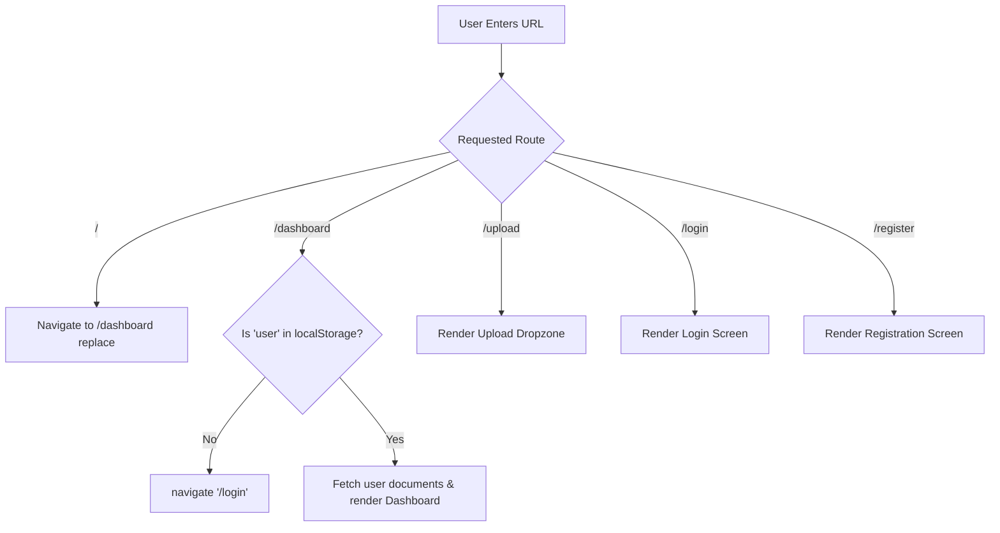

# Frontend Routing & Navigation

This document explains the client-side routing architecture implemented with **React Router DOM v7** (`react-router-dom@7.18.3`).

---

## 🗺️ Route Map & Structure

Defined in `frontend/src/App.tsx`:

```tsx
import { BrowserRouter, Routes, Route, Navigate } from 'react-router-dom';
import Header from './components/header';
import Footer from './components/footer';
import Login from './pages/login';
import Register from './pages/register';
import Dashboard from './pages/dashboard';
import Upload from './pages/upload';

function App() {
  return (
    <BrowserRouter>
      <Header />
      <main style={{ flex: 1, display: 'flex', flexDirection: 'column' }}>
        <Routes>
          <Route path="/register" element={<Register />} />
          <Route path="/login" element={<Login />} />
          <Route path="/dashboard" element={<Dashboard />} />
          <Route path="/upload" element={<Upload />} />
          <Route path="/" element={<Navigate to="/dashboard" replace />} />
        </Routes>
      </main>
      <Footer />
    </BrowserRouter>
  );
}
```

---

## 🚦 Navigation & Guard Behavior



### Route Descriptions:
1. **`/` (Root)**: Automatically executes a permanent replace redirect to `/dashboard`.
2. **`/dashboard`**: Protected view; verifies user session in `localStorage`. If absent, immediately redirects to `/login`.
3. **`/upload`**: Document ingestion page; allows authenticated users to upload PDF documents.
4. **`/login`**: Public authentication page.
5. **`/register`**: Public signup page.
