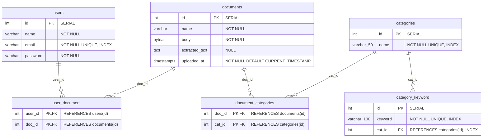

# Database Schema & Physical Specifications

This document defines the complete PostgreSQL relational schema, including table columns, data types, primary keys, foreign key constraints, default values, and index definitions.

---

## 🗄️ Database Schema Diagram

---

## 📋 Comprehensive Table Column Specifications

### Table 1: `users`
| Column Name | SQL Type | Nullable | Constraints / Index | Description |
| :--- | :--- | :--- | :--- | :--- |
| `id` | `INTEGER` | `NO` | `PRIMARY KEY`, `SERIAL` | Auto-incrementing user ID |
| `name` | `VARCHAR` | `NO` | — | User's full display name |
| `email` | `VARCHAR` | `NO` | `UNIQUE`, B-Tree Index | User login email address |
| `password` | `VARCHAR` | `NO` | — | Argon2 password hash string |

---

### Table 2: `categories`
| Column Name | SQL Type | Nullable | Constraints / Index | Description |
| :--- | :--- | :--- | :--- | :--- |
| `id` | `INTEGER` | `NO` | `PRIMARY KEY`, Resequenced (1..6) | Canonical category ID |
| `name` | `VARCHAR(50)` | `NO` | `UNIQUE`, B-Tree Index | Unique category name |

---

### Table 3: `documents`
| Column Name | SQL Type | Nullable | Constraints / Index | Description |
| :--- | :--- | :--- | :--- | :--- |
| `id` | `INTEGER` | `NO` | `PRIMARY KEY`, `SERIAL` | Auto-incrementing document ID |
| `name` | `VARCHAR` | `NO` | — | Original uploaded file name |
| `body` | `BYTEA` | `NO` | — | Binary PDF byte payload |
| `extracted_text` | `TEXT` | `YES` | — | Extracted digital/OCR text |
| `uploaded_at` | `TIMESTAMPTZ`| `NO` | `DEFAULT CURRENT_TIMESTAMP` | Ingestion timestamp with timezone |

---

### Table 4: `user_document` (Junction Table)
| Column Name | SQL Type | Nullable | Constraints / Index | Description |
| :--- | :--- | :--- | :--- | :--- |
| `user_id` | `INTEGER` | `NO` | `PRIMARY KEY (Composite)`, `FK -> users.id` | Owner user ID |
| `doc_id` | `INTEGER` | `NO` | `PRIMARY KEY (Composite)`, `FK -> documents.id` | Associated document ID |

---

### Table 5: `document_categories` (Junction Table)
| Column Name | SQL Type | Nullable | Constraints / Index | Description |
| :--- | :--- | :--- | :--- | :--- |
| `doc_id` | `INTEGER` | `NO` | `PRIMARY KEY (Composite)`, `FK -> documents.id` | Associated document ID |
| `cat_id` | `INTEGER` | `NO` | `PRIMARY KEY (Composite)`, `FK -> categories.id` | Associated category ID |

---

### Table 6: `category_keyword`
| Column Name | SQL Type | Nullable | Constraints / Index | Description |
| :--- | :--- | :--- | :--- | :--- |
| `id` | `INTEGER` | `NO` | `PRIMARY KEY`, `SERIAL` | Auto-incrementing keyword ID |
| `keyword` | `VARCHAR(100)`| `NO` | `UNIQUE`, B-Tree Index | Domain reference keyword string |
| `cat_id` | `INTEGER` | `NO` | `FK -> categories.id`, B-Tree Index | Target category mapping |
