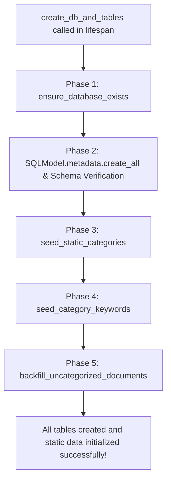

# Database Migrations, Seeding & Backfill

This document explains how database schema evolution, canonical category seeding, keyword synchronization, and historical document backfilling are executed in the application.

---

## 🚀 Application Startup Initialization Sequence

When the FastAPI backend starts, `create_db_and_tables()` in `backend/src/data/database.py` executes 5 automated phases:



---

## 🛠️ Phase-by-Phase Technical Details

### Phase 1: `ensure_database_exists()`
Connects to the maintenance database (`DEFAULT_DB="postgres"`) using `psycopg2`. Queries `pg_database` to check if `DB_NAME="Document"` exists. If not, executes:
```sql
CREATE DATABASE Document;
```

---

### Phase 2: `create_all()` & Dynamic Schema Verification
1. Generates DDL for all SQLModel models that do not yet exist in PostgreSQL.
2. Runs non-destructive schema migrations using direct SQL driver calls:
```sql
ALTER TABLE documents ADD COLUMN IF NOT EXISTS extracted_text TEXT;
ALTER TABLE categories ALTER COLUMN name TYPE VARCHAR(50);
ALTER TABLE documents ADD COLUMN IF NOT EXISTS uploaded_at TIMESTAMP WITH TIME ZONE DEFAULT CURRENT_TIMESTAMP;
```

---

### Phase 3: `seed_static_categories()`
Ensures that the 6 canonical categories exist and are mapped to sequential primary key IDs `1` to `6`:
1. Deletes duplicate category records (grouping by `LOWER(name)`).
2. Inserts any missing canonical category names.
3. Resequences category IDs `1..6` while updating child foreign keys in `document_categories` and `category_keyword`.
4. Resets the PostgreSQL sequence counter:
```sql
SELECT setval(pg_get_serial_sequence('categories', 'id'), (SELECT COALESCE(MAX(id), 1) FROM categories));
```

---

### Phase 4: `seed_category_keywords()`
Populates domain keywords into the `category_keyword` table from `STATIC_CATEGORY_KEYWORDS`. Uses an idempotency check (`existing_keywords = {kw.keyword.lower() for kw in existing_records}`) to prevent duplicate entries on successive reboots.

---

### Phase 5: `backfill_uncategorized_documents()`
Scans the `documents` table for any documents without entries in `document_categories`.
1. If `extracted_text` is empty, extracts text via PyMuPDF/RapidOCR from `doc.body`.
2. Runs `classify_document_multi_category()` and inserts matching `DocumentCategories` records into PostgreSQL.
