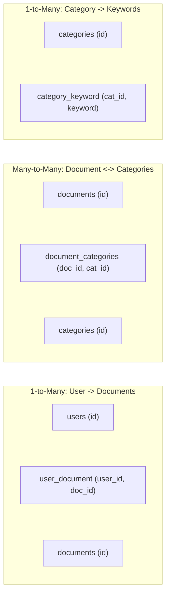

# Database Relationships & Query Traversal

This document explains the relational modeling, foreign key constraints, and query patterns used to traverse data across entities.

---

## 🔗 Relational Mappings Overview



---

## 🔍 Relational Traversal Query Patterns

### 1. Querying Documents Owned by a User
Implemented in `backend/src/api/users.py:get_user_documents`:
```python
# Step A: Get all document IDs owned by user_id
user_docs = session.exec(
    select(UserDocument).where(UserDocument.user_id == user_id)
).all()
doc_ids = [ud.doc_id for ud in user_docs]

# Step B: Select Document records
documents = session.exec(
    select(Document).where(col(Document.id).in_(doc_ids))
).all()

# Step C: Attach category IDs for each document
for doc in documents:
    doc_cats = session.exec(
        select(DocumentCategories.cat_id).where(DocumentCategories.doc_id == doc.id)
    ).all()
```

---

### 2. Querying Documents Belonging to a Category
Implemented in `backend/src/api/categories.py:get_category_documents`:
```python
# Step A: Find all doc_ids mapped to cat_id
doc_links = session.exec(
    select(DocumentCategories).where(DocumentCategories.cat_id == category_id)
).all()
doc_ids = [link.doc_id for link in doc_links]

# Step B: Select all matching Document entities
documents = session.exec(
    select(Document).where(col(Document.id).in_(doc_ids))
).all()
```

---

### 3. Cascading Category Keywords
Implemented in `backend/src/model/categorizer.py`:
```python
keywords = session.exec(select(CategoryKeyword)).all()
# Maps each keyword to its parent Category ID:
# CategoryKeyword(id=1, keyword='tax invoice', cat_id=1)
```
This enables fast dictionary lookups and dynamic keyword boosting against live database records.
