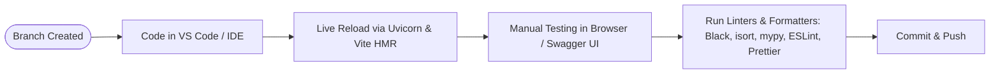

# Development Workflow

This document outlines the standard daily development workflow, hot-reload capabilities, and code validation steps for contributing to the **Document Management System**.

---

## 🔄 Daily Development Cycle



---

## ⚡ Hot-Reload & Local Services

### 1. Backend Hot-Reload
- The command `uvicorn main:app --reload` monitors Python source files under the project root and `backend/`.
- When any `.py` file is modified and saved, Uvicorn automatically detects the change, reloads the modules, and restarts the ASGI server within milliseconds.

### 2. Frontend Hot Module Replacement (HMR)
- Vite runs an in-memory development server with native ES modules and instant Hot Module Replacement (`pnpm run dev`).
- Modifications in `.tsx`, `.ts`, or `.css` files update the browser view instantly without full page reloads.

---

## 🛠️ Pre-Commit Verification Commands

Before committing code changes, run the code quality tools:

### Backend Quality Check
```bash
# Sort imports
isort backend main.py

# Format code
black backend main.py

# Type checking
mypy backend
```

### Frontend Quality Check
```bash
cd frontend

# Linting
pnpm run lint

# Formatting check
pnpm run format:check

# Type check & bundle verification
pnpm run build

cd ..
```
