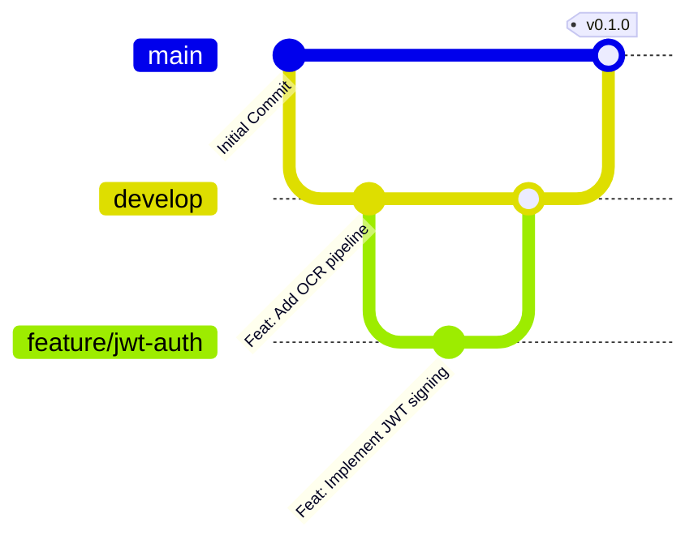

# Git Version Control & Workflow

This document outlines the recommended Git branching strategy, commit conventions, and repository setup for the **Document Management System**.

---

## 🌿 Recommended Branching Model



1. **`main`**: Production-ready, stable codebase. Direct commits are restricted.
2. **`develop`**: Integration branch for ongoing feature development.
3. **`feature/<feature-name>`**: Short-lived feature branches created from `develop`.
4. **`fix/<bug-name>`**: Bugfix branches merged into `develop` and `main`.

---

## 📝 Commit Message Guidelines

Follow the **Conventional Commits** specification:

```text
<type>(<scope>): <short summary>

[optional body explaining rationale]

[optional footer referencing issue/ticket]
```

### Supported Types:
- `feat`: A new feature (e.g., `feat(ocr): add support for multi-column PDF layouts`).
- `fix`: A bug fix (e.g., `fix(auth): handle password hash mismatch cleanly`).
- `docs`: Documentation updates (e.g., `docs(api): update OpenAPI schemas in api-reference.md`).
- `style`: Formatting changes that do not affect code logic (e.g., `style: format Python with black`).
- `refactor`: Code refactoring without feature or bug changes.
- `test`: Adding or updating test cases.
- `chore`: Tooling, dependency, or configuration updates.

---

## 🚫 Files Excluded from Version Control (`.gitignore`)

The project `.gitignore` explicitly excludes:
- Python virtual environments (`.venv/`, `env/`, `venv/`).
- Python cache directories (`__pycache__/`, `*.pyc`, `*.pyo`).
- Tool caches (`.mypy_cache/`, `.pytest_cache/`, `.ruff_cache/`).
- Node modules & build artifacts (`frontend/node_modules/`, `frontend/dist/`).
- Local environment files (`.env`, `.env.local`).
- OS artifacts (`Thumbs.db`, `.DS_Store`).
