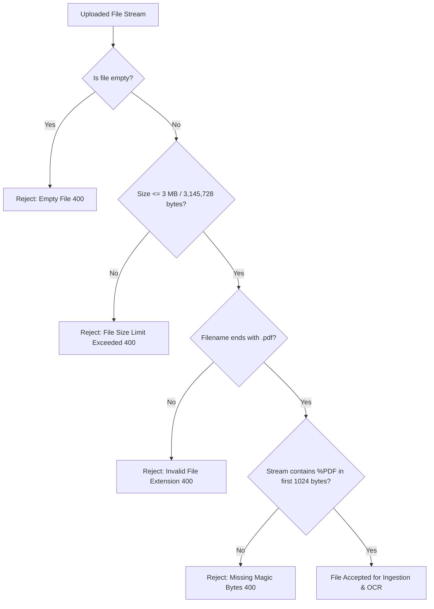

# File Upload Security & Magic-Byte Validation

This document details the file upload security defenses implemented in `backend/src/model/contents.py`.

---

## 🛡️ File Security Architecture

---

## 🔬 Attack Mitigation Matrix

| Threat / Attack Vector | Mitigation in Codebase | Source Code Location |
| :--- | :--- | :--- |
| **Extension Spoofing** (e.g. `malware.exe.pdf` or renaming `.exe` to `.pdf`) | Inspects file binary stream for `%PDF` magic bytes signature in the first 1024 bytes. | `backend/src/model/contents.py` (Line 88) |
| **Denial of Service via Huge Files** (Zip bombs / Multi-Gigabyte uploads) | Rejects any payload exceeding `MAX_FILE_SIZE_BYTES` ($3 \text{ MB}$) before processing. | `backend/src/constants/constant.py` (Line 30) |
| **Path Traversal Attacks** (e.g. `../../etc/passwd` filenames) | Binary payloads are stored in PostgreSQL `BYTEA` memory tables; filenames are never written to disk paths. | `backend/src/api/document.py` (Line 345) |
| **Arbitrary Code Execution via Parser Exploits** | Files are parsed in-memory with PyMuPDF bindings; non-PDF bytes trigger `InvalidFileTypeError` before parsing. | `backend/src/model/contents.py` (Line 124) |
