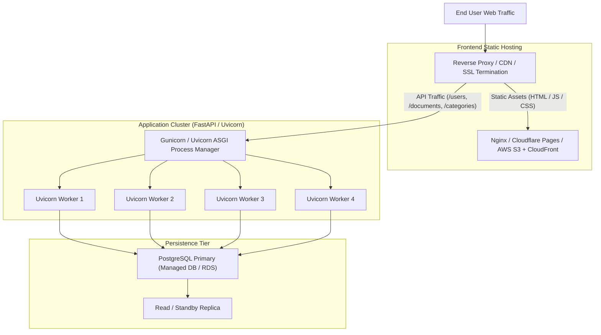

# Deployment Overview & Production Topologies

This document outlines deployment architectures, production build processes, and operational topologies for the **Document Management System**.

> **Audit Note**: Dockerfiles, Kubernetes manifests, and CI/CD pipelines are not currently present in the repository. The deployment strategies documented below are based on verified application build and runtime requirements.

---

## 🏗️ Production Deployment Topology

---

## 📦 Build Artifact Summary

| Component | Build Tool / Command | Output Artifact | Hosting Target |
| :--- | :--- | :--- | :--- |
| **Frontend** | `pnpm run build` (`tsc -b && vite build`) | `frontend/dist/` (HTML, JS bundles, CSS) | Nginx, AWS S3 / CloudFront, Vercel, Cloudflare Pages |
| **Backend** | Python Package / Wheel | Python 3.12 Virtual Environment | Linux VM (systemd), Docker Container, AWS ECS, GCP Cloud Run |
| **Database** | PostgreSQL 14+ | PostgreSQL Schema & Tables | Managed AWS RDS, GCP Cloud SQL, or self-hosted PostgreSQL |
