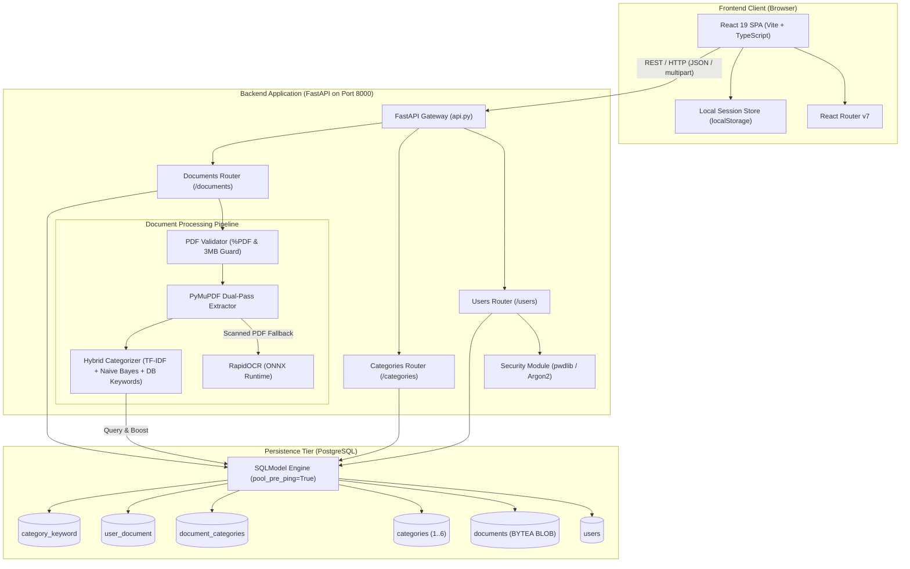

# Document Management System — Technical Documentation

Welcome to the comprehensive technical documentation for the **Document Management System** (DMS). This documentation suite provides software engineers, architects, DevOps specialists, and code auditors with a 100% verified, source-code-accurate guide to understanding, building, running, extending, and maintaining this application.

---

## 🧭 Documentation System Map

```text
docs/
├── README.md                             # Documentation Homepage & System Map (Current File)
├── DOCUMENTATION_AUDIT.md                # Codebase Verification & Coverage Audit Report
├── DOCUMENTATION_ISSUES.md               # Technical Debt, Inconsistencies & Security Findings
│
├── 01-overview/                          # System Purpose, Capabilities & High-Level Design
│   ├── project-overview.md               # Business purpose, problem statement, key workflows
│   ├── features.md                       # Implemented, partially implemented & planned features
│   ├── technology-stack.md               # Verified backend, frontend, ORM, OCR & ML tech stack
│   ├── project-structure.md              # Physical repository directory layout & file responsibilities
│   └── glossary.md                       # Domain terminology, acronyms & definitions
│
├── 02-getting-started/                   # Onboarding & Environment Setup Guides
│   ├── prerequisites.md                  # Required runtime runtimes, tools, versions & system specs
│   ├── installation.md                   # Step-by-step backend & frontend package installation
│   ├── environment-setup.md              # Configuration variables, `.env` files & templates
│   ├── database-setup.md                 # PostgreSQL installation, database creation & auto-seeding
│   ├── running-locally.md                # Exact commands to run development servers & verify health
│   └── troubleshooting.md                # Common setup errors, port conflicts & verified resolutions
│
├── 03-architecture/                      # System Architecture & Component Interactions
│   ├── system-architecture.md            # High-level architecture, module boundaries & Mermaid diagrams
│   ├── frontend-architecture.md          # React 19 SPA architecture, state management & routing
│   ├── backend-architecture.md           # FastAPI architecture, lifespan events, modular routers & DI
│   ├── database-architecture.md          # PostgreSQL architecture, SQLModel ORM & connection pooling
│   ├── api-architecture.md               # REST API design conventions, DTO schemas & error handling
│   └── data-flow.md                      # End-to-end data flow for document ingestion & classification
│
├── 04-backend/                           # Backend Deep Dive & Processing Engines
│   ├── backend-structure.md              # Backend package structure (`src/api`, `src/data`, `src/model`)
│   ├── api-endpoints.md                  # Route catalog for Users, Categories & Documents
│   ├── authentication.md                 # Password hashing (Argon2 / pwdlib), login & credentials
│   ├── document-processing.md            # Ingestion lifecycle, size validation & BYTEA BLOB storage
│   ├── pdf-processing.md                 # PyMuPDF digital text extraction & 150 DPI page rendering
│   ├── ocr.md                            # RapidOCR (ONNX Runtime) OCR engine, singleton caching
│   ├── classification.md                 # Hybrid ML (TF-IDF + Naive Bayes) + DB keyword boosting
│   └── error-handling.md                 # Exception handlers, validation error schemas & HTTP codes
│
├── 05-frontend/                          # Frontend Web Application Deep Dive
│   ├── frontend-structure.md             # React component hierarchy & stylesheet organization
│   ├── pages.md                          # Route pages (Login, Register, Dashboard, Upload)
│   ├── components.md                     # Reusable UI components (Header, Footer, CategoryCard)
│   ├── routing.md                        # React Router v7 configuration, navigation & guards
│   ├── api-integration.md                # Fetch clients, multipart uploads & BLOB downloads
│   └── authentication.md                 # Client-side session management (`localStorage`) & logout
│
├── 06-database/                          # Database Schemas & Data Layer
│   ├── database-schema.md                # PostgreSQL schema reference & complete Mermaid ERD
│   ├── tables-and-models.md              # SQLModel table definitions & column constraints
│   ├── relationships.md                  # Junction tables (1-to-Many & Many-to-Many mappings)
│   └── migrations.md                     # Dynamic schema initialization, seeding & document backfill
│
├── 07-development/                       # Engineering Standards & Tooling
│   ├── development-workflow.md           # Day-to-day coding workflows & hot-reload setup
│   ├── coding-standards.md               # Python & TypeScript coding guidelines & type annotations
│   ├── testing.md                        # Testing landscape, pytest/vitest guidance & test matrices
│   ├── linting-and-formatting.md         # Black, isort, mypy, ESLint 10 & Prettier configurations
│   └── git-workflow.md                   # Branching models, commit conventions & Git setup
│
├── 08-security/                          # Security Review & Protections
│   ├── security-overview.md              # Defense-in-depth posture & threat mitigation
│   ├── file-security.md                  # MIME checking, magic bytes (%PDF) & 3MB upload guard
│   ├── authentication-security.md        # Password hashing with Argon2, credentials & session state
│   └── environment-security.md           # Secret handling, CORS policies & SQL injection defense
│
├── 09-deployment/                        # Deployment Guides & Production Operations
│   ├── deployment-overview.md            # Production architecture & deployment topologies
│   ├── frontend-deployment.md            # Vite production builds (`dist/`) & static asset hosting
│   ├── backend-deployment.md             # Uvicorn / Gunicorn production execution & systemd/container
│   ├── database-deployment.md            # PostgreSQL production configuration, pooling & maintenance
│   └── production-checklist.md           # Go-live verification checklist
│
├── 10-maintenance/                       # Operations, Reliability & Maintenance
│   ├── monitoring.md                     # Health checks (`/health`), logging & performance tracking
│   ├── backups.md                        # PostgreSQL database backup (`pg_dump`) & recovery
│   ├── troubleshooting.md                # Operational incidents, OCR memory issues & debugging
│   └── maintenance-guide.md              # Category synchronization, keyword tuning & DB pruning
│
└── 11-reference/                         # Quick Reference Sheets
    ├── api-reference.md                  # Complete OpenAPI 3.1 specification & endpoint reference
    ├── environment-variables.md          # Environment variable reference table with defaults
    └── commands.md                       # Comprehensive CLI commands cheat sheet
```

---

## ⚡ Quick-Start Path

If you are setting up the project for the first time on a fresh workstation:

1. **Review System Requirements**: Read [`02-getting-started/prerequisites.md`](file:///c:/Users/shail/OneDrive/Desktop/project/docs/02-getting-started/prerequisites.md).
2. **Install Dependencies**: Follow [`02-getting-started/installation.md`](file:///c:/Users/shail/OneDrive/Desktop/project/docs/02-getting-started/installation.md).
3. **Configure Database & Environment**: Follow [`02-getting-started/environment-setup.md`](file:///c:/Users/shail/OneDrive/Desktop/project/docs/02-getting-started/environment-setup.md) and [`02-getting-started/database-setup.md`](file:///c:/Users/shail/OneDrive/Desktop/project/docs/02-getting-started/database-setup.md).
4. **Launch Local Services**: Run the commands detailed in [`02-getting-started/running-locally.md`](file:///c:/Users/shail/OneDrive/Desktop/project/docs/02-getting-started/running-locally.md).
5. **Verify System Health**: Open `http://localhost:8000/health` (Backend) and `http://localhost:5173` (Frontend).

---

## 📐 System Architecture at a Glance



---

## 🔍 Core Application Roles & Responsibilities

| Subsystem | Tech Stack | Primary Responsibility |
| :--- | :--- | :--- |
| **Backend Core** | FastAPI, Python 3.12, Uvicorn | RESTful API service exposing CRUD operations for users, categories, and documents with lifespan DB provisioning. |
| **Document Ingestion** | PyMuPDF, `python-multipart` | Defense-in-depth PDF file validation (magic bytes, extension, 3 MB limit), memory streaming, and digital text extraction. |
| **OCR Fallback Engine** | RapidOCR (ONNX Runtime), Pillow | Singleton-cached OCR inference on rasterized 150 DPI page pixmaps when digital text is absent (scanned PDFs). |
| **Categorization Engine** | scikit-learn, SQLModel | Hybrid classification blending TF-IDF + Multinomial Naive Bayes with dynamic SQL keyword boosting (`category_keyword` table). |
| **Data Layer** | SQLModel, PostgreSQL, psycopg2 | Relational schema persistence storing user profiles, document binary BLOBs (`BYTEA`), categories, and junction mappings. |
| **Frontend Web App** | React 19, TypeScript, Vite | Single-page application providing user authentication, document drag-and-drop upload, instant categorization feedback, and category-filtered document browsing/downloading. |

---

## 📌 Architectural Governance & Codebase Source of Truth

This entire documentation repository was generated by an in-depth audit of every Python file, TypeScript file, CSS stylesheet, SQLModel schema, and configuration file within the codebase. 

Where discrepancies exist between standard production practices and the current implementation (such as tokenless authentication or hardcoded URLs), they are explicitly cataloged in [`docs/DOCUMENTATION_ISSUES.md`](file:///c:/Users/shail/OneDrive/Desktop/project/docs/DOCUMENTATION_ISSUES.md) rather than obscured.
